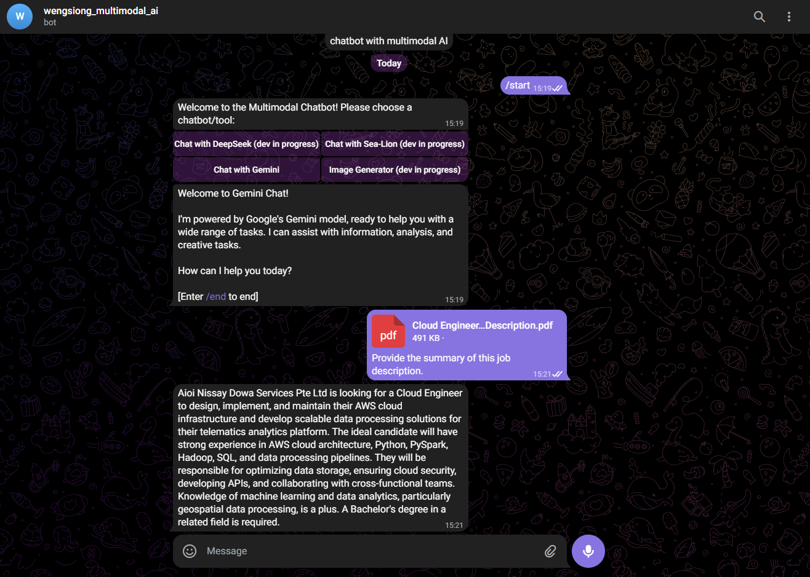

# Multimodal Telegram Bot

A powerful multimodal Telegram bot that integrates multiple AI models and supports various file formats for intelligent conversations and content generation.

## Features

### Currently Available
- **Gemini Chat**: Powered by Google's Gemini 2.0 Flash model for intelligent conversations
- **File Processing**: Support for CSV, Excel, and PDF file uploads with content analysis
- **Interactive Menu**: User-friendly inline keyboard for model selection
- **Message Chunking**: Automatic handling of long messages (>4096 characters)
- **Webhook Support**: Production-ready webhook implementation

### *In Development*
- **DeepSeek Chat**: Advanced AI assistant (requires self-hosted deployment/API key)
- **Sea-Lion Chat**: Friendly AI companion (requires self-hosted deployment/API key)  
- **Stable Diffusion Image Generator**: Text-to-image generation (requires self-hosted deployment/API key)

## Overview



## Prerequisites

- Python 3.8+
- Telegram Bot Token (from [@BotFather](https://t.me/botfather))
- Google Gemini API Key
- Flask-compatible hosting environment

## Installation & Setup

### Important Note About Local Development

**This application uses webhooks and cannot be run locally without modifications.** Webhooks require a public HTTPS URL that Telegram can reach. 

**Options for development:**

1. **Deploy directly to a cloud service** (Recommended - see Deployment section)
2. **Use ngrok for local development:**
   ```bash
   # Install ngrok and expose your local server
   ngrok http 5000
   # Use the ngrok HTTPS URL for webhook setup
   ```
3. **Modify the code to use polling instead of webhooks** (requires code changes)

### Cloud Deployment Setup

Since this app requires a public HTTPS URL, follow the deployment steps below to get it running.

## Configuration

### Telegram Bot Setup
#### Create a new bot

1. Go to [BotFather](https://t.me/botfather)
2. Send the `/newbot` command
3. Enter the name of your bot
4. Enter the username of your bot (the name must end with `bot`)
5. Copy the bot token for your application

#### Set the bot's description and profile picture

1. Go to [BotFather](https://t.me/botfather)
2. Send the `/setdescription` command
3. Select the bot you want to set the description for
4. Enter the description of your bot
5. Send the `/setuserpic` command
6. Select the bot you want to set the profile picture for
7. Send the profile picture of your bot

### Gemini API Setup
1. Visit [Google AI Studio](https://aistudio.google.com/)
2. Generate an API key

## Usage

### Starting the Bot
1. Send `/start` to your bot on Telegram
2. Choose from the available AI models using the inline keyboard
3. Start chatting or upload supported files

### Supported File Types
- **CSV Files**: Tabular data analysis
- **Excel Files**: Spreadsheet processing  
- **PDF Files**: Document text extraction

### Commands
- `/start` - Initialize bot and show model selection
- `/end` - End current session and return to main menu

### File Upload
1. Upload a supported file (CSV, Excel, or PDF)
2. Add your question/prompt in the file caption
3. The bot will process the file content and respond based on your prompt

## Project Structure

```
multimodal-telegram/
├── app.py              # Main Flask application
├── config.py           # Configuration management
├── requirements.txt    # Python dependencies
├── apps/
│   ├── __init__.py
│   └── gemini.py      # Gemini model integration
├── assets/            # Static assets
└── .gitignore
```

## Deployment

### Production (using Render.com)

1. Connect your repository to Render.com
2. Create a new web service
3. Enter the name of your web service
4. Keep the `Language` as Python3
5. Keep the `Branch` as `main`
6. Keep the build command as `pip install -r requirements.txt`
7. Keep the start command as `gunicorn app:app`
8. Select Instance Type as `Free` for hobby project
9. Add the following environment variables:
    ```bash
    TELEGRAM_API_KEY=your_telegram_api_key
    GOOGLE_API_KEY=your_google_api_key
    ```
10. Deploy the application

## Future Development

### Additional Models (In Progress)
The following models require self-hosted deployment/API key and are currently under development:

1. **DeepSeek**: Advanced reasoning and coding capabilities
2. **Sea-Lion**: Southeast Asia-focused language model
3. **Stable Diffusion**: High-quality image generation

These models will be integrated once self-hosting infrastructure is established.

## Acknowledgments

- Google Gemini for AI capabilities
- Telegram Bot API for messaging platform
- Flask for web framework

---

**Note**: This bot is actively under development. Some features marked as "in development" require additional infrastructure setup and API keys and are not yet fully functional.